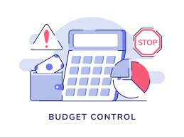

 

   
  
  
## Description
This project aims to create an app where users can plan their budgets.

## Project Live
[Budget_app]()

## How to use the app
💰 You can list your expenses in the table by date and expense name. 
💰 You can enter your income information and add more later. 
💰 You can see your total income amount, total expenditure amount and remaining amount. 
💰 Listed expenses can be deleted or changed. 
💰 All information can be reset if desired. 

## How does the project look?

## Built With
- HTML5
- Bootstrap
- Dom Manipulation
- Vanilla Javascript
- localstorage
